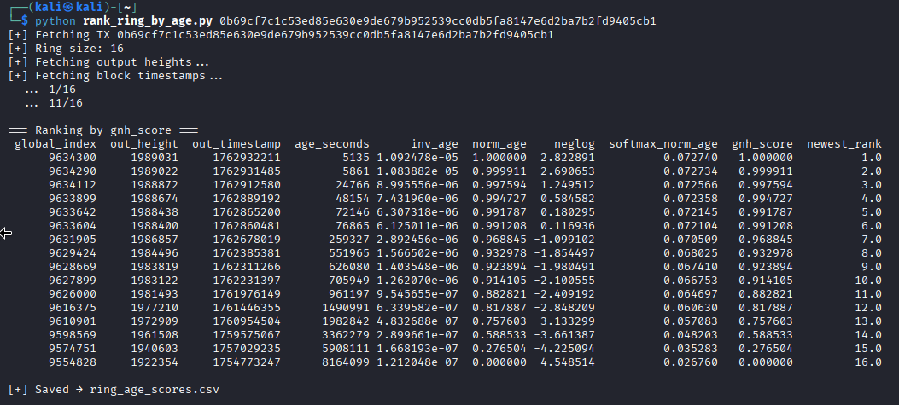

# Guess Newest Heuristic (GNH)
**python rank_ring_by_age.py <tx_hash>**

> Refer to image.
> - global_index: The global output index  
> - out_height: The block height where output was created (higher height=newer block)  
> - out_timestamp: Unix timestamp (when was it mined)
> - age_seconds: Age of the output at the moment tx was mined (how long since mined)
> - inv_age, norm_age, neglog, softmax_norm_age: Various scoring heuristics
> - gnh_score: Main score used for GNH (scoring metric, equates to norm_age)
> - newest_rank: The ranking (1 = youngest/newest output)

## How it works
- Monero rings contain one real input and 15 decoys.  
- Code ranks the ring members (real spend + 15 decoys) by how recently each referenced output was created.  
- Outputs with lower _age_seconds_ are newer.  
- GNH assumes real spent output is usually one of the newer ones(historically true due to spending-change quickly)(find research paper)
    > **_newest_rank_ : _age_seconds_ : _global_index_:**  
    > Rank 1: 5135 seconds old : 9634300  
    > Rank 2: 5861 seconds old : 9634290  
    > Rank 3: 24766 seconds old : 9634112  

## norm_age
**Formula:** norm_age = [(max(ages)−age) / (max(ages)-min(ages))]  
**Legend:** 
- age: Age of particular ring output
- min(ages): Youngest output
- max(ages): Oldest output

**Guide:**  
_norm_age_ = 1.0 (youngest output in the ring)  
_norm_age_ ≈ 0.99x (very close in age)  
_norm_age_ ≈ 0.9x (significantly older)  
_norm_age_ < 0.8 (clearly old decoy)  

### Why is it needed?   
Monero outputs have wildly different ages ranging from seconds, weeks, years.  
Raw ages like 5135, 705949, or 8,164,099 seconds cannot be directly compared easily.  

### Normalization solves this by:
- Scaling ages into a 0–1 range  
- Making comparisons independent of absolute times  
- Treating the “newest” as 1.0 and “oldest” as 0.0  
- Stretches the age differences across the full 0–1 range, even if the raw ages vary massively.

**Calculation Example:** (Using row 2 from image with _global_index_ of 9634290)  
norm_age = [(max(ages)−age) / (max(ages)-min(ages))]  
 = [(8164099 − 5861) / (8164099 - 5135)]  
 = 0.999911  

## Monero RPC Functions Used
### /get_transactions
Given transaction hash,  
**Fetches: Extracted Value : Purpose**
- full transaction JSON : as_json : Extracting ring members (key offsets)
- block height containing the transaction : block_height : Block containing the tx
- block timestamp of the transaction : block_timestamp : Timestamp of the tx

### /get_block_header_by_height
**Motive:** _get_outs_ only gives the block height for each ring output. To compute the age in seconds, need the exact block timestamp.  
Converts the height to timestamp.  
Given a block height,  
**Fetches: Extracted Value : Purpose**
- block timestamp : timestamp : To compute output age

### /get_outs
**Motive:** Query the block height of each output referenced in the ring. Needed to know how old each ring member is, to calculate GNH score.  
Given amount and global index,  
**Fetches: Extracted Value : Purpose**
- height : o["height"] : Needed to fetch timestamp of the output  

> [!NOTE]
> _get_transactions_ gives info about the input transaction(spending tx), but not the history of all outputs in the ring.