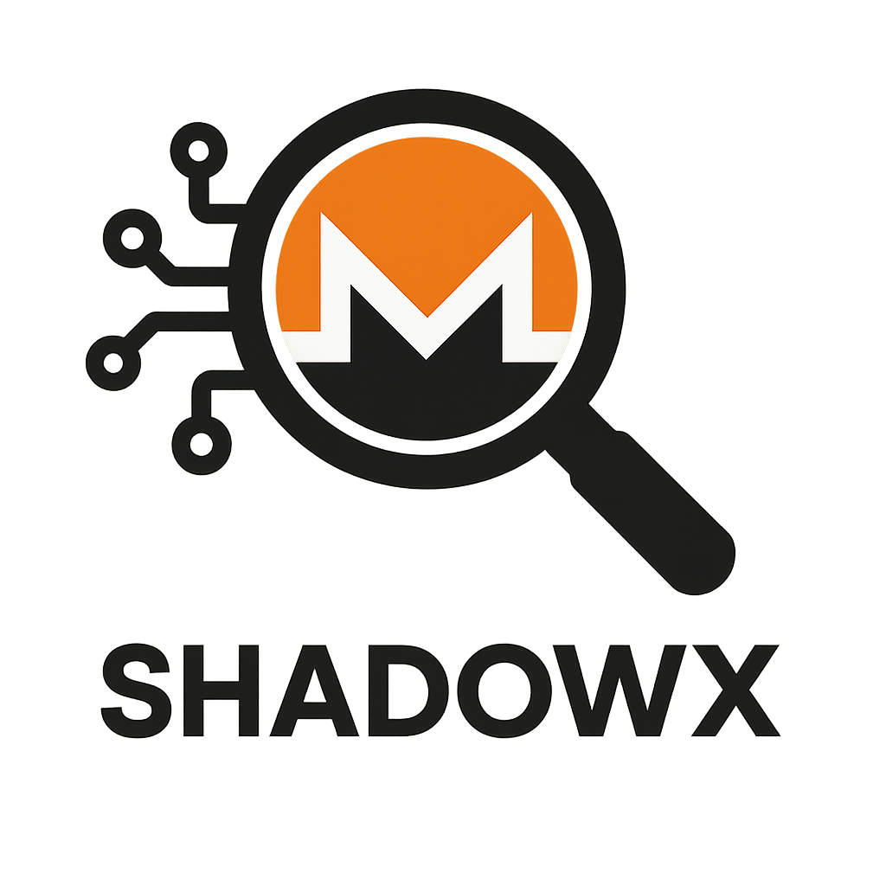

### ShadowX - A Monero Analysis Web Tool
<p align="center">
  
</p>

## Using the tool:
- Currently, this tool is only tested and used in Linux Environment only
- After cloning, renamed the main folder to "ShadowX", then place the folder inside in your user home Directory (/home/kali/ShadowX)


- The folder structure will be like this:
```
ShadowX/
├── templates/
├── uploadedFiles/
    ├── stagenet
        ├── lmdb
├── static/
├── analysis/
├── monero-x86_64-linux-gnu-v0.18.4.4/
├── app.py
├── img/
```

- You need to create the folders uploadedFiles, stagenet and lmdb. They are not on github because they are empty by nature, thus github do not publish empty directories
- The tool assumes you have a hold on the data.mdb file for analysis. After starting the web app (app.py) at localhost:5000, proceed to upload the data.mdb file at the index page
- When successfully uploaded, the data.mdb file will be stored inside lmdb folder (uploadedFiles > stagenet > lmdb)

- Once uploaded successful, start the monero stagenet service, the monero files will be auto generated and be created inside the stagenet folder. A lock.mdb will also be created inside the lmdb folder. (where your uploaded data.mdb is stored)

- The RPC server is following the default port at 38081 in localhost. To verify it is working, can do a simple curl. 
- Once you are done using the web app, do remember to end the monero service to shut off the monero service properly!